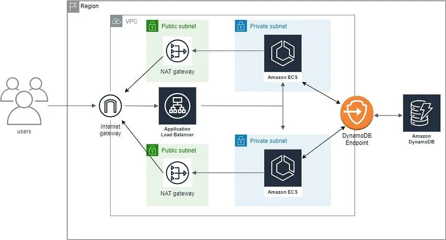

## Desafio GlobalHitss |

```bash
    Aqui está o que você precisa fazer:
    1) Crie uma VPC na AWS com subnets públicas e privadas utilizando Terraform.
    2) Crie um módulo Terraform para configurar um cluster ECS Fargate.
    3) Crie um módulo para configurar um Application Load Balancer (ALB) público que encaminhe o tráfego para a aplicação em execução no ECS.
    4) Disponibilize uma aplicação de exemplo (pode ser uma simples aplicação web) no ECS Fargate.
    5) O código da aplicação deve ser armazenado em um repositório do GitHub.

    Passos detalhados:
    - Utilize um módulo para criar a VPC e subnets.
    - Utilize outro módulo para configurar o ECS Fargate, incluindo a definição do serviço e da tarefa.
    - Configure o ALB para rotear as requisições para as instâncias do ECS.
    - Certifique-se de que a aplicação esteja acessível publicamente através do ALB.
```
---


## Requirements
1. Terraform
2. Credentials AWS

Add AWS access credentials to your operating system environment variables.Ex:

```bash
AWS_ACCESS_KEY_ID     =XXXXXXXXXXXXXXXXXXXXXX
AWS_SECRET_ACCESS_KEY =XXXXXXXXXXXXXXXXXXXXXXXXXXXXX
AWS_SESSION_TOKEN     =XXXXXXXXXXXXXXXXXXXXXXXXXXXXXX
AWS_REGION            =XXXX
```

Open the command terminal or an ide of your choice. Navigate to the main project folder **"src"** then run the following command:
```bash
terraform init
```
Now let's reference it in the production environment, to do this use the following command:
```bash
terraform workspace new PRD
```
Check the execution plan:
```bash
terraform plan
```
Run the code
```bash
terraform apply --auto-approve
```

<!-- BEGIN_TF_DOCS -->
## Requirements

| Name | Version |
|------|---------|
| <a name="requirement_aws"></a> [aws](#requirement\_aws) | 5.74.0 |

## Providers

| Name | Version |
|------|---------|
| <a name="provider_aws"></a> [aws](#provider\_aws) | 5.74.0 |

## Modules

| Name | Source | Version |
|------|--------|---------|
| <a name="module_alb"></a> [alb](#module\_alb) | ../modules/alb | n/a |
| <a name="module_cluster_ecs"></a> [cluster\_ecs](#module\_cluster\_ecs) | ../modules/ecs | n/a |
| <a name="module_vpc"></a> [vpc](#module\_vpc) | terraform-aws-modules/vpc/aws | n/a |

## Resources

| Name | Type |
|------|------|
| [aws_iam_role.ecsTaskExecutionRole](https://registry.terraform.io/providers/hashicorp/aws/5.74.0/docs/resources/iam_role) | resource |
| [aws_iam_role.ecsTaskRole](https://registry.terraform.io/providers/hashicorp/aws/5.74.0/docs/resources/iam_role) | resource |
| [aws_iam_role_policy_attachment.ecsTaskExecutionRole_policy](https://registry.terraform.io/providers/hashicorp/aws/5.74.0/docs/resources/iam_role_policy_attachment) | resource |
| [aws_security_group.sg](https://registry.terraform.io/providers/hashicorp/aws/5.74.0/docs/resources/security_group) | resource |
| [aws_iam_policy_document.assume_role_policy](https://registry.terraform.io/providers/hashicorp/aws/5.74.0/docs/data-sources/iam_policy_document) | data source |

## Inputs

| Name | Description | Type | Default | Required |
|------|-------------|------|---------|:--------:|
| <a name="input_alb"></a> [alb](#input\_alb) | values for the alb | `map` | <pre>{<br>  "HML": {},<br>  "PRD": {<br>    "health_check": {<br>      "healthy_threshold": 3,<br>      "interval": 30,<br>      "matcher": "200",<br>      "path": "/",<br>      "port": "traffic-port",<br>      "protocol": "HTTP",<br>      "timeout": 10,<br>      "unhealthy_threshold": 2<br>    },<br>    "listener_action_type": "forward",<br>    "listener_port": "80",<br>    "listener_protocol": "HTTP",<br>    "name": "desafio-load-balancer",<br>    "target_name": "test",<br>    "target_port": 80,<br>    "target_protocol": "HTTP",<br>    "target_type": "ip"<br>  }<br>}</pre> | no |
| <a name="input_ecs"></a> [ecs](#input\_ecs) | values for the ecs | `map` | <pre>{<br>  "HML": {},<br>  "PRD": {<br>    "cluster": {<br>      "execution_role_arn": "aws_iam_role.ecs_task_execution_role.arn",<br>      "family": "demo-family",<br>      "name": "demo-cluster"<br>    },<br>    "service": {<br>      "assign_public_ip": true,<br>      "container_name": "demo-container",<br>      "container_port": 80,<br>      "name": "demo-service"<br>    },<br>    "tpl": {<br>      "app_image": "barcelos3/app-v1:latest",<br>      "app_port": 80,<br>      "fargate_cpu": "1024",<br>      "fargate_memory": "2048",<br>      "file": "../templates/ecs/myapp.json.tpl",<br>      "region": "us-east-1"<br>    }<br>  }<br>}</pre> | no |
| <a name="input_sg"></a> [sg](#input\_sg) | values for the security group | `map` | <pre>{<br>  "HML": {},<br>  "PRD": {<br>    "alb": {<br>      "description": "Security group for alb app",<br>      "egress": "../rules/alb_egress_rules.csv",<br>      "ingress": "../rules/alb_ingress_rules.csv",<br>      "name": "demo-sg-alb",<br>      "revoke_rules_on_delete": true<br>    },<br>    "ecs": {<br>      "description": "Security group for ecs app",<br>      "egress": "../rules/ecs_egress_rules.csv",<br>      "ingress": "../rules/ecs_ingress_rules.csv",<br>      "name": "demo-sg-ecs",<br>      "revoke_rules_on_delete": true<br>    }<br>  }<br>}</pre> | no |
| <a name="input_subnet"></a> [subnet](#input\_subnet) | values for the subnets | `map` | <pre>{<br>  "HML": {},<br>  "PRD": {<br>    "private": {<br>      "cidr_block": [<br>        "10.0.1.0/24",<br>        "10.0.2.0/24"<br>      ],<br>      "name": "sub-pvt",<br>      "route_table_name": "private-rt"<br>    },<br>    "public": {<br>      "cidr_block": [<br>        "10.0.101.0/24",<br>        "10.0.102.0/24"<br>      ],<br>      "name": "sub-public",<br>      "route_table_name": "public-rt"<br>    },<br>    "region": [<br>      "use1-az1",<br>      "use1-az2",<br>      "use1-az3"<br>    ]<br>  }<br>}</pre> | no |
| <a name="input_vpc"></a> [vpc](#input\_vpc) | values for the vpc | `map` | <pre>{<br>  "HML": {},<br>  "PRD": {<br>    "cidr_block": "10.0.0.0/16",<br>    "enable_dns": true,<br>    "name": "vpc-network",<br>    "nat": true,<br>    "region": "us-east-1",<br>    "vpn": false<br>  }<br>}</pre> | no |

## Outputs

| Name | Description |
|------|-------------|
| <a name="output_alb_arn"></a> [alb\_arn](#output\_alb\_arn) | value of the alb arn |
| <a name="output_alb_dns_name"></a> [alb\_dns\_name](#output\_alb\_dns\_name) | value of the alb dns name |
| <a name="output_alb_name"></a> [alb\_name](#output\_alb\_name) | value of the alb name |
| <a name="output_ecs_cluster_name"></a> [ecs\_cluster\_name](#output\_ecs\_cluster\_name) | value of the ecs cluster name |
| <a name="output_ecs_service_name"></a> [ecs\_service\_name](#output\_ecs\_service\_name) | value of the ecs service name |
| <a name="output_ecs_task_cpu"></a> [ecs\_task\_cpu](#output\_ecs\_task\_cpu) | value of the ecs task cpu |
| <a name="output_ecs_task_memory"></a> [ecs\_task\_memory](#output\_ecs\_task\_memory) | value of the ecs task memory |
| <a name="output_security_group_ids"></a> [security\_group\_ids](#output\_security\_group\_ids) | value of the security group ids |
<!-- END_TF_DOCS -->